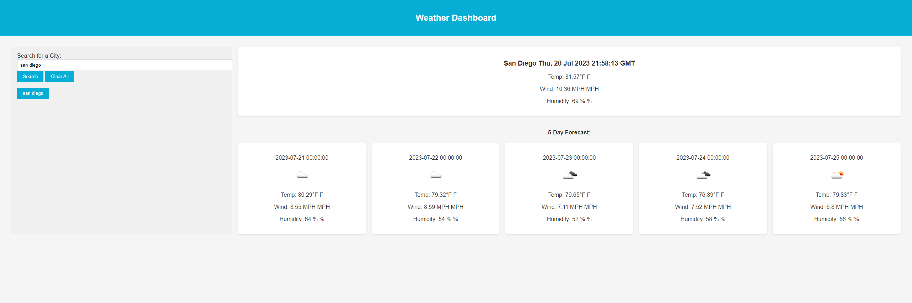

# Weather Dashboard

## Description

The Weather Dashboard is a fully responsive web application designed to provide users with convenient access to weather information. Whether you need to check the current weather or plan ahead with a 5-day forecast, this application has got you covered.

## Usage

1. Enter the name of a city in the search input field.
2. Click the "Search" button to fetch and display the current weather and 5-day forecast for the entered city.
3. Previously searched cities are saved as clickable buttons in the search history section for quick access.
## License

Please refer to the LICENSE in the repo.

## Webpage Preview

# Links

[Deployed Website](https://connorg45.github.io/weather-dashboard/)

[Github Repo](https://github.com/connorg45/weather-dashboard)